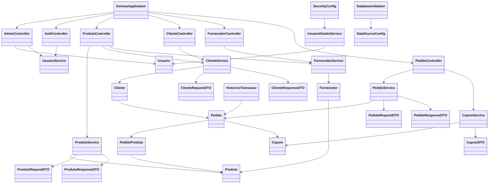

# Projeto Dunnas

Projeto Dunnas é uma aplicação web desenvolvida em Java com Spring Boot, voltada para a gestão de clientes, fornecedores, produtos, pedidos e cupons. O sistema foi projetado para facilitar operações comerciais entre fornecedores e clientes, incluindo cadastro, gerenciamento de produtos, pedidos, pagamentos e histórico de transações.

---

## Diagrama de Classes



---

## Funcionalidades

- **Cadastro e autenticação de usuários** (clientes, fornecedores, administradores)
- **Gestão de produtos** (cadastro, edição, exclusão, visualização)
- **Gestão de pedidos** (criação, histórico, associação de produtos)
- **Gestão de cupons** (criação, validação e aplicação)
- **Painel administrativo** para gerenciamento de usuários e cupons
- **Procedimentos automatizados** para pagamentos, saldo e registro de operações
- **Histórico de transações** para clientes e fornecedores

---

## Estrutura do Projeto

```
src/
  main/
    java/
      com/example/dunnas/
        DunnasApplication.java
        config/
        controller/
        dto/
        enuns/
        exception/
        model/
        security/
        service/
    resources/
      application.properties
      db/migration/
      static/
      webapp/WEB-INF/jsp/
```

---

## Principais Classes

- **DunnasApplication**: Classe principal para inicialização do Spring Boot.
- **Controllers**: Gerenciam as requisições HTTP e a lógica de apresentação.
- **Services**: Implementam as regras de negócio e interagem com as entidades.
- **Entities**: Representam os dados persistidos no banco (Cliente, Fornecedor, Produto, Pedido, Cupom, etc.).
- **DTOs**: Facilitam a transferência de dados entre camadas.
- **SecurityConfig**: Configurações de autenticação e autorização.
- **DatabaseInitializer**: Inicializa dados e configurações do banco.

---

## Ferramentas Utilizadas

- **Java 21**
- **Spring Boot**
- **Spring Security**
- **JSP** para views
- **Maven** para gerenciamento de dependências
- **Banco de dados relacional** (PostgreSQL)

---

## Como Executar

1. Clone o repositório:
   ```bash
   git clone https://github.com/edu-doc/Dunnas
   cd Dunnas
   ```
2. Configure o banco de dados em `src/main/resources/application.properties`.
3. Execute as migrações SQL (Flyway).
4. Inicie a aplicação:
   ```bash
   ./mvnw spring-boot:run
   ```
5. Acesse via navegador: `http://localhost:8080`

---

## Finalidade

O Projeto Dunnas foi criado para facilitar a gestão de operações comerciais entre fornecedores e clientes, automatizando processos de pedidos, pagamentos, controle de produtos e cupons.

---
